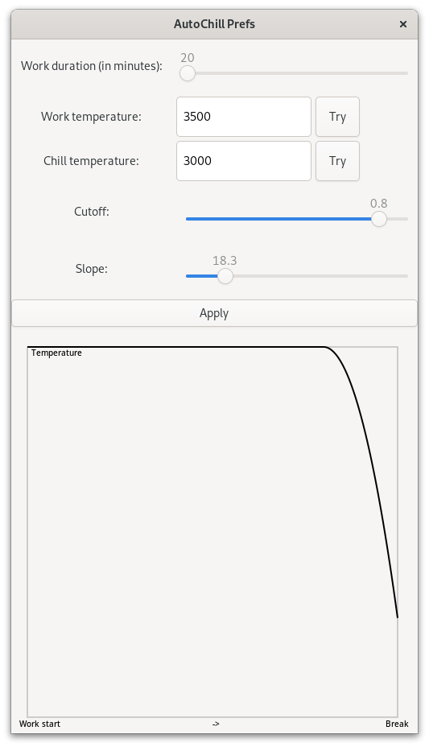

autochill
=========

A gnome extension to help you chill by setting up breath time.

Autochill progressively warms up your screen light temperature and it prompts you to take a break after some time.

> As of gnome 45, the light temperature no longers work reliably

# Usage

Run the standalone CLI:

```ShellSession
$ gjs --module ./autochill@tristancacqueray.github.io/cli.js --run
```

Configure the standalone CLI:

```ShellSession
$ gjs --module ./autochill@tristancacqueray.github.io/cli.js --prefs
```



# Contribute

Contributions are most welcome.

To modify autochill, you will need a [PureScript][purescript] toolchain and the gnome developper tool.
Run the `nix-shell` command to setup.

```ShellSession
# Ensure purescript-gjs is cloned in the parent directory
git clone https://github.com/purescript-gjs/purescript-gjs ../purescript-gjs
# Build javascript
make dist

# Run a nested gnome-shell session
make test
```

Checkout the [purescript-gjs][purescript-gjs] bindings too.

# Changes

## 0.1

- Initial release.

[purescript]: https://www.purescript.org/
[purescript-gjs]: https://github.com/purescript-gjs/purescript-gjs
